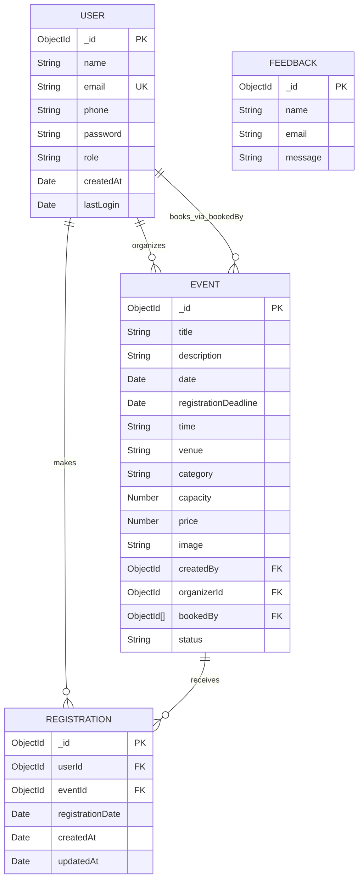

# Entity Relationship Diagram

Feedback is stored in the `feedback` collection but has no User or Event reference in the current schema. `Event.bookedBy` is the legacy denormalized booking list; new participant registrations also create a `Registration` document.
